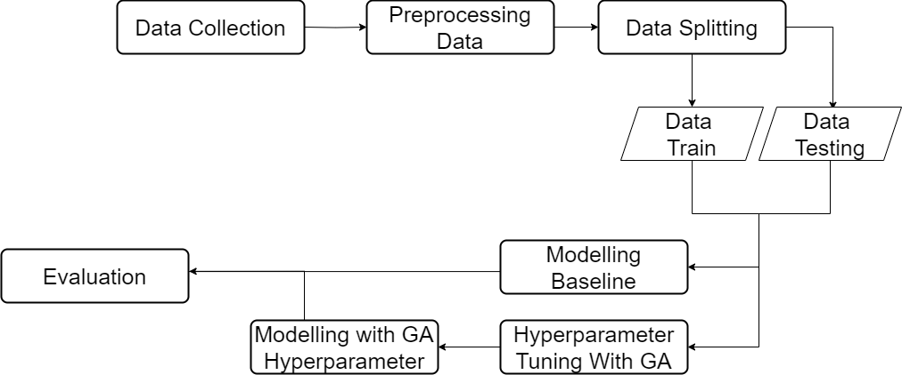

# Hyperparameter Tuning of Random Forest Using Genetic Algorithm: Optimizing Model Performance

This project aims to perform hyperparameter tuning of random forest using genetic algorithm. It is expected that the performance of random forest will increase after the tuning.

# Dataset

In this project, the data used is "Heart Disease Classification Dataset" which
can be accessed at [here](https://www.kaggle.com/datasets/bharath011/heart-disease-classification-dataset) 

The size of the dataset is 1319 samples, which have nine fields, where eight fields are for input fields and one field for an output field. Age, gender (0 for Female, 1 for Male) ,heart rate (impulse), systolic BP (pressurehight), diastolic BP (pressurelow), blood sugar(glucose), CK-MB (kcm), and Test-Troponin (troponin) are representing the input fields, while the output field pertains to the presence of heart attack (class), which is divided into two categories (negative and positive); negative refers to the absence of a heart attack, while positive refers to the presence of a heart attack.

# Methodology
The stages of this project consist of 6 stages starting from data collection, data preprocessing, modelling baseline, hyperparameter tuning with GA, modelling with GA and model evaluation.

Full code of this project at here [full code](https://github.com/WiseStar282/random-forest-with-GA/blob/main/Hyperparameter%20Tuning%20RF%20with%20GA%20.ipynb)
See my article at here [article]('https://medium.com/@ahmadbintangarif/optimizing-random-forest-for-heart-disease-classification-using-genetic-algorithms-4a350fe60bd2')

